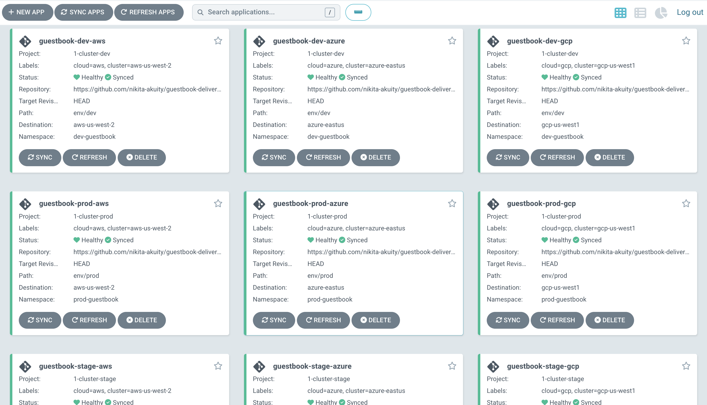

# Using Akuity Platform with Amazon Web Services, Azure and Google Cloud Platform

## Links
* [Akuity Platform](https://akuity.cloud)
* [Akuity Platform Docs](https://docs.akuity.io/)
* Terraform provider: ([github](https://github.com/akuity/terraform-provider-akp)), ([TF registry](https://registry.terraform.io/providers/akuity/akp/latest))

## Folders

### [1-cluster](/1-cluster/)

Contains TF files to create a cluster in one of the three cloud providers and add this cluster to an existing Argo CD instance running on Akuity Platform and named `tf-managed-demo`.

This is an example of adding Azure cluster:
```hcl
data "akp_instance" "argocd" {
  name    = "tf-managed-demo"
}

resource "akp_cluster" "cluster" {
  instance_id      = data.akp_instance.argocd.id
  name             = "azure-${var.azure_region}"
  namespace        = "akuity"
  size             = "small"
  labels           = {
    purpose = "guestbook"
    cloud   = "azure"
    dev     = "true"
    stage   = "true"
    prod    = "true"
  }
  kube_config = {
    host                   = azurerm_kubernetes_cluster.example.kube_config.0.host
    username               = azurerm_kubernetes_cluster.example.kube_config.0.username
    password               = azurerm_kubernetes_cluster.example.kube_config.0.password
    client_certificate     = base64decode(azurerm_kubernetes_cluster.example.kube_config.0.client_certificate)
    client_key             = base64decode(azurerm_kubernetes_cluster.example.kube_config.0.client_key)
    cluster_ca_certificate = base64decode(azurerm_kubernetes_cluster.example.kube_config.0.cluster_ca_certificate)
  }
}
```

See the full example in the corresponding folders

#### [1-cluster/argocd-files](/1-cluster/argocd-files/)

Use this folder as a source for the main Argo CD application.
It creates a number of projects with jsonnet, and an a guestbook Applicationset that uses cluster labels to generate list of clusters and create an Application resource for each of them.

Total number of applications should be 9 as we have 3 clusters, each one with 3 environment labels:



### [100-clusters](/100-clusters/)

Contains TF files to create a new Argo CD instance, 3 physical clusters and any number of virtual clusters using namespace-scoped Akuity agent installations.
Virtual clusters are separated by environment and cloud, and named `gcp-dev-01`, `azure-stage-03` etc.

-------------

All examples are tested with akp provider version `0.3.0` 
